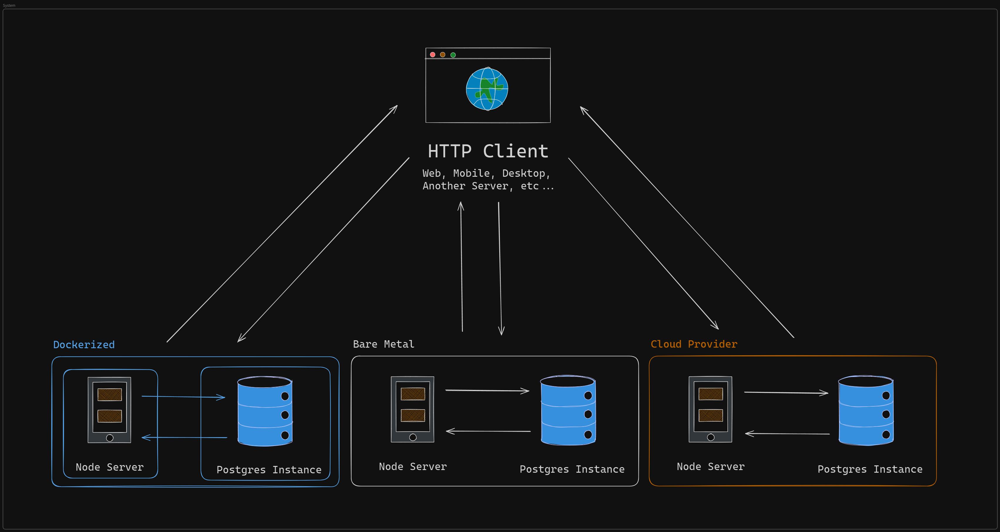
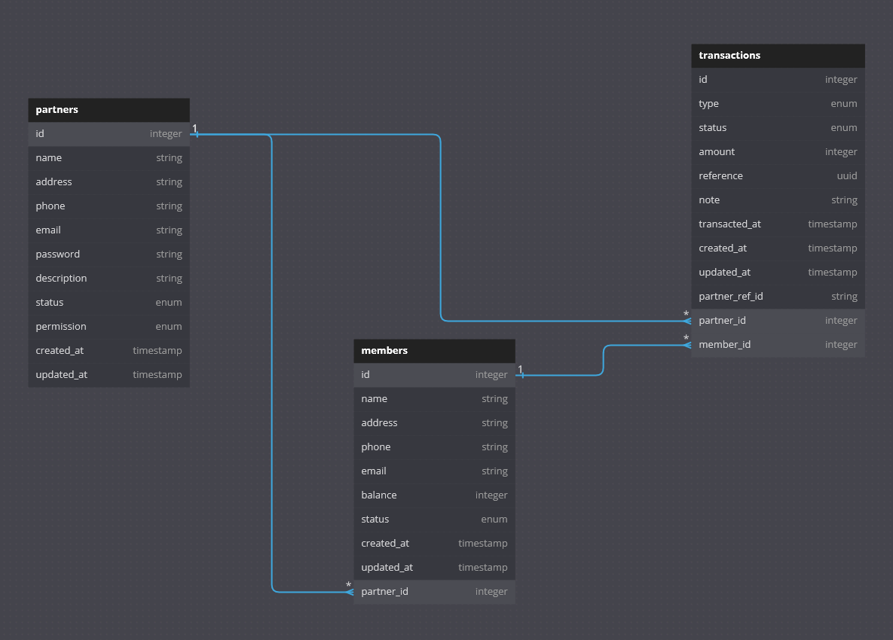

# [**Pay With Pretend Points API**](https://paywithpretendpointsapi.onrender.com/) 💸 

Manage and earn points in a loyalty and rewards system.


## Requirements 🖥️

- **You will need [`Node.JS`](https://nodejs.org/en/download/package-manager/current) `22.7.0` and [`npm`](https://www.npmjs.com/) `10.8.2` installed if you're not using Docker:**

  ```json
  "engines": {
    "node": "22.7.0",
    "npm": "10.8.2"
  },
  ```

- **Alternatively, you can also run this using [`Bun`](https://bun.sh/) `latest` while using the same setup.**

- **Otherwise, you will need [`Docker`](https://www.docker.com/products/docker-desktop/) installed to run this in a containerized environment.**

- **For an optimal developer experience, we recommend using the plugins in [`extensions.json`](./.vscode/extensions.json).**

## Getting Started 🚀

### **Without Docker**

1. **Clone the repository:**

   ```bash
   git clone https://github.com/HackTheNorth-FakeWithPoints/PayWithPretendPointsAPI.git

   cd PayWithPretendPointsAPI
   ```

2. **Install dependencies:**

   ```bash
   npm install
   ```

3. **Run the server in development mode:**

   ```bash
   npm run dev
   ```

### **With Docker**

1. **Clone the repository:**

   ```bash
   git clone https://github.com/HackTheNorth-FakeWithPoints/PayWithPretendPointsAPI.git

   cd PayWithPretendPointsAPI
   ```

2. **Build the image and start the containers:**

   ```bash
   docker compose -f docker-compose.local.yml up --build
   ```

## Development 🛠️

### **Contributing**

**Commits must follow the format of:**

`feat|fix|chore|docs|test|style|refactor|perf|build|ci|revert:(<scope>): "Your commit message here."`

```bash
git commit -m "feat(app): initial commit"

git commit -m "feat: initial commit"
```

### **Database**

**Install [Postgres](https://www.postgresql.org/download/) or spin up a local database instance via Docker:**

`Note: this is only if you want a standalone database and you're running the API without docker.`

```bash
docker compose -f docker-compose.db.local.yml up --build
```

**Sequelize migration template:**

```js
'use strict'

module.exports = {
  /**
   * @param {import('sequelize').QueryInterface} queryInterface
   * @param {import('sequelize').Sequelize & import('sequelize').DataTypes} Sequelize
   * @returns {Promise<void>}
   */
  up: async (queryInterface, Sequelize) => {
    // your migration creation here...
  },
  /**
   * @param {import('sequelize').QueryInterface} queryInterface
   * @returns {Promise<void>}
   */
  down: async (queryInterface) => {
    // your migration revert here...
  }
}
```

### **Testing**

**For testing out api calls you can use our [`Postman collection here`](./postman/PayWitPretendPointsAPI.postman_collection.json) or our [`Bruno collection here`](./bruno).**

**Read more about [`Postman`](https://www.postman.com/) or [`Bruno`](https://www.usebruno.com/) here.**

### **Business Logic**

- **Transactions can only created if a Partner's _status_ is `ACTIVE` and its _permission_ is `WRITE` or `BALANCE_INQUIRY`**

- **Transactions can only created if a Members's _status_ is `ACTIVE`**

- **Transactions can no longer be updated if its _status_ is no longer `PENDING`**

- **Transactions will deduct from a Member's _balance_ if its _status_ is updated to `VOIDED`**

### **Standards**

**For developers, follow the structure below when adding to or refactoring the codebase:**

| Directory                                  | Description                                                 | Repository                                                                                            |
| ------------------------------------------ | ----------------------------------------------------------- | ----------------------------------------------------------------------------------------------------- |
| [**`constants`**](./src/constants)         | **for reusuable values that don't change**                  | [Pay With Pretend Points API](https://github.com/HackTheNorth-FakeWithPoints/PayWithPretendPointsAPI) |
| [**`controllers`**](./src/controllers)     | **for implementing business logic**                         | [Pay With Pretend Points API](https://github.com/HackTheNorth-FakeWithPoints/PayWithPretendPointsAPI) |
| [**`db/config`**](./src/db/config)         | **for database configuration, such as connection setup**    | [Pay With Pretend Points API](https://github.com/HackTheNorth-FakeWithPoints/PayWithPretendPointsAPI) |
| [**`db/migrations`**](./src/db/migrations) | **for modifying the database schema**                       | [Pay With Pretend Points API](https://github.com/HackTheNorth-FakeWithPoints/PayWithPretendPointsAPI) |
| [**`db/models`**](./src/db/models)         | **for defining database schema structures**                 | [Pay With Pretend Points API](https://github.com/HackTheNorth-FakeWithPoints/PayWithPretendPointsAPI) |
| [**`db/providers`**](./src/db/providers)   | **to get data and modify the database**                     | [Pay With Pretend Points API](https://github.com/HackTheNorth-FakeWithPoints/PayWithPretendPointsAPI) |
| [**`logger`**](./src/logger)               | **terminal logging configuration**                          | [Pay With Pretend Points API](https://github.com/HackTheNorth-FakeWithPoints/PayWithPretendPointsAPI) |
| [**`middleware`**](./src/middleware)       | **for request intercepting functions**                      | [Pay With Pretend Points API](https://github.com/HackTheNorth-FakeWithPoints/PayWithPretendPointsAPI) |
| [**`routes`**](./src/routes)               | **for defining callable api endpoints**                     | [Pay With Pretend Points API](https://github.com/HackTheNorth-FakeWithPoints/PayWithPretendPointsAPI) |
| [**`server`**](./src/server)               | **for configuring and starting the Express instance**       | [Pay With Pretend Points API](https://github.com/HackTheNorth-FakeWithPoints/PayWithPretendPointsAPI) |
| [**`swagger`**](./src/swagger)             | **for auto-generating the OpenAPI specification**           | [Pay With Pretend Points API](https://github.com/HackTheNorth-FakeWithPoints/PayWithPretendPointsAPI) |
| [**`types`**](./src/types)                 | **for reusuable user-defined TypeScript types**             | [Pay With Pretend Points API](https://github.com/HackTheNorth-FakeWithPoints/PayWithPretendPointsAPI) |
| [**`utils`**](./src/utils)                 | **for reusuable helper functions used in different places** | [Pay With Pretend Points API](https://github.com/HackTheNorth-FakeWithPoints/PayWithPretendPointsAPI) |

## Commands 🤖

### **Custom Commands**

**Run the `migrate` command to apply database migrations:**

```bash
npm run migrate
```

**Run the `migrate:revert` command to revert database migrations:**

```bash
npm run migrate:revert
```

**Run the `swagger` command to generate oas.yml:**

```bash
npm run swagger
```

**Run the `validate` command to check errors and if build passes:**

```bash
npm run validate
```

**Run the `format` command to fix errors and check the build:**

```bash
npm run format
```

**Run the `build` command to create a production build of the app:**

```bash
npm run build
```

**Run the `start` command to start the app with a production build:**

```bash
npm run start
```

### **Utility Commands (NPM)**

```bash
# install dependencies specified in package.json
npm install

# check for latest minor and patch versions of dependencies
npm outdated

# update all outdated dependencies to latest minor and patch versions
npm update

# check for unused dependencies (devDependencies and imports can be ignored)
npx depcheck

# update all dependencies to latest major version (breaking changes may occur)
npx npm-check-updates -u
```

### **Utility Commands (Docker)**

```bash
# remove all containers
docker system prune --force --all

# remove all volumes
docker volume prune --filter all=1
```

## Architecture 🏠

### **System Diagram**

Can be ran in either bare metal, Docker or cloud native configurations.



### **Database Schema**

`Partners` has many `Members` which has many `Transactions`, `Partners` also have many `Transactions`.



## Contributors ✨

**Big thanks to the team for making this possible!**

| Name                  | GitHub Handle                                      | Role                         | Organization                                                                   |
| --------------------- | -------------------------------------------------- | ---------------------------- | ------------------------------------------------------------------------------ |
| **Geoffrey Peart**    | [@GeoffreyPeart](https://github.com/GeoffreyPeart) | Lead Organizer and Developer | [@HackTheNorth-FakeWithPoints](https://github.com/HackTheNorth-FakeWithPoints) |
| **Tony Liu**          | [@szboynono](https://github.com/szboynono)         | Lead Organizer and Developer | [@HackTheNorth-FakeWithPoints](https://github.com/HackTheNorth-FakeWithPoints) |
| **Bryan Peart**       | [@BryanPeart](https://github.com/BryanPeart)       | Developer                    | [@HackTheNorth-FakeWithPoints](https://github.com/HackTheNorth-FakeWithPoints) |
| **Sachin Chandwani**  | [@Sachin-c](https://github.com/Sachin-c)           | Developer                    | [@HackTheNorth-FakeWithPoints](https://github.com/HackTheNorth-FakeWithPoints) |
| **Tapiwa Kundishora** | [@tapiwakundi](https://github.com/tapiwakundi)     | Developer                    | [@HackTheNorth-FakeWithPoints](https://github.com/HackTheNorth-FakeWithPoints) |
| **Jacky Tea**         | [@jackytea](https://github.com/jackytea)           | Developer                    | [@HackTheNorth-FakeWithPoints](https://github.com/HackTheNorth-FakeWithPoints) |
